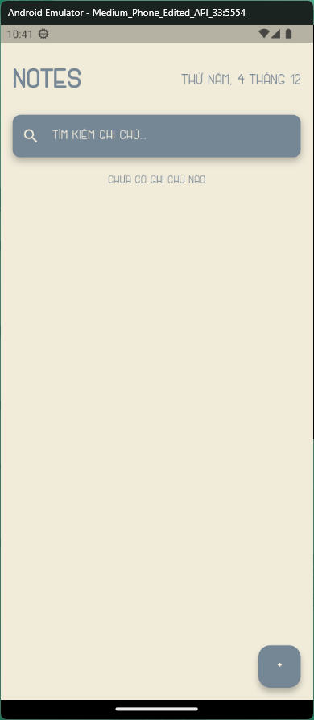
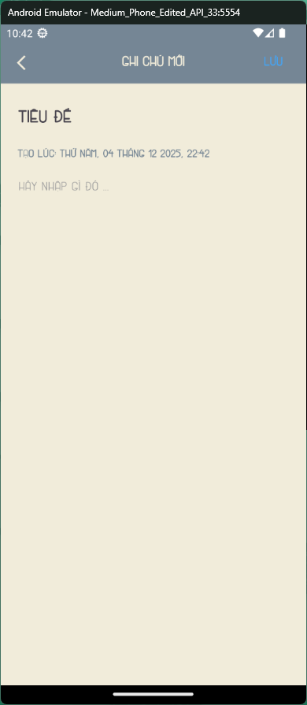
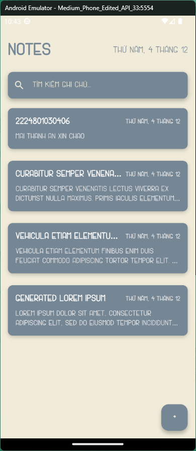
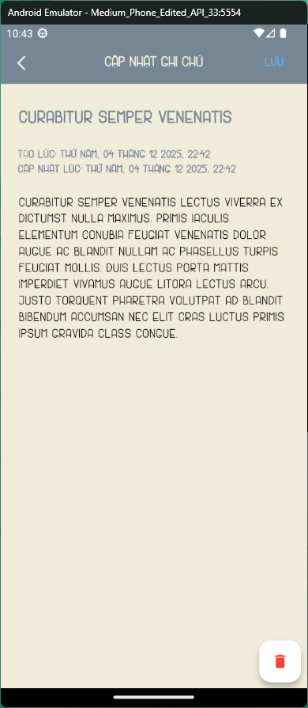
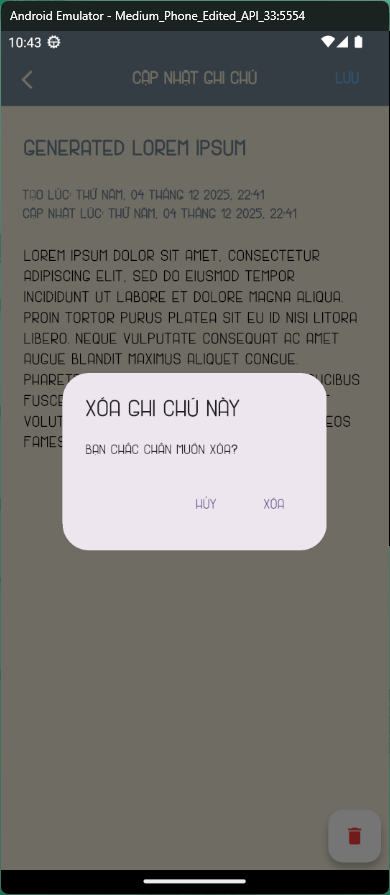
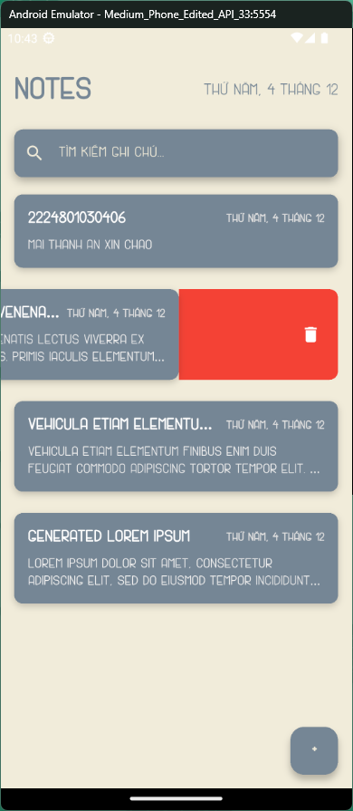
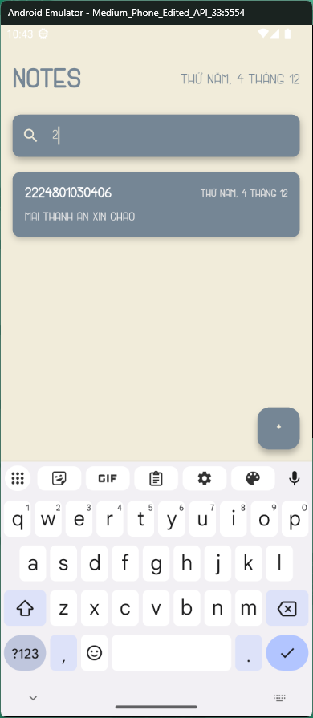

# Simple Note App
Project description 
This is the simple note app
The required about this exercise:
Create a simple note app include these features:
- Create new note
- View all notes
- Edit the created note
- Delete note with confirmation
- Timestamp tracking
## ii. Screenshots of my app
This is a main screen of my app


## iii. How to run the project
You can run a project with debug mode at root folder
## iv. feature in my project
## 1. Create new note
Create a new note with title and content


------------------------------
## 2. View all notes
The home screen and can see all notes saved


------------------------------
## 3. Edit the created note
Edit created note with title and content and timestamp tracking


------------------------------
## 4. Delete note with confirmation
Can delete the saved note with confirmation


------------------------------
## 5. Extension
Swipe from right to left to delete note with confirmation


------------------------------
Search bar can search the note


------------------------------
## v. project architecture
created by extension in VSCode not by AI.
```
└── 📁lib
    └── 📁database
        ├── note_service.dart
    └── 📁models
        ├── note_model.dart
    └── 📁providers
        ├── note_viewmodel.dart
    └── 📁screens
        ├── home_page.dart
        ├── note_editor_screen.dart
        ├── note_new_screen.dart
    └── 📁widgets
        ├── note_item.dart
        ├── notes_list.dart
        ├── search_bar.dart
    ├── constants.dart
    └── main.dart
```
